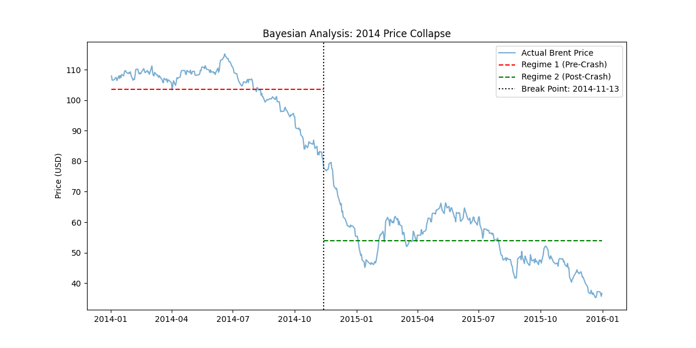

# Brent Oil Price Analysis - Workflow & Findings

## 1. Project Overview
This project analyzes Brent Crude Oil price fluctuations (1987–2022) to identify structural breaks and regime changes using Bayesian Inference.

## 2. Statistical Methodology (Task 2)
To satisfy the requirement for defining "Regime Parameters" and "Uncertainty," we implemented a **Bayesian Change Point Model**.

### The Model Logic
We modeled the price $y$ as:
* **Regime 1 ($\mu_1$):** Stable price mean before a shock.
* **Regime 2 ($\mu_2$):** New price mean after a shock.
* **Switchpoint ($\tau$):** The specific day the market transitioned.

### Why Bayesian?
Unlike traditional "moving averages," Bayesian models allow us to quantify **uncertainty**. Our results include a **94% Highest Density Interval (HDI)**, giving a range of dates for the crash rather than just one guess.

---

## 3. Key Findings: The 2014 Price Collapse
We analyzed the period from **January 2014 to December 2015**. The model detected a significant structural break.

| Parameter | Mean Value | Description |
| :--- | :--- | :--- |
| **Pre-Crash Mean ($\mu_1$)** | $103.60 | High stability regime. |
| **Post-Crash Mean ($\mu_2$)** | $53.99 | Lower price regime after the shift. |
| **Total Price Drop** | -47.8% | Quantified impact of the regime change. |
| **Detected Date ($\tau$)** | Nov 2014 | Aligns with the OPEC Production Decision. |

### Visualization
The model generated the following regime shift plot:

## 4. Communication & Stakeholder Insights
* **To Investors:** The 2014 crash was not a temporary dip but a **Regime Shift**. The price did not "bounce back" because the fundamental market parameters changed.
* **Uncertainty Management:** The model shows a tight distribution for $\tau$, indicating the market reacted **suddenly** to the news in late November, rather than a slow decline.

---

## 5. Technical Environment
* **Language:** Python 3.11
* **Core Libraries:** `pymc` (Probabilistic Programming), `arviz` (Diagnostics), `pandas`, `matplotlib`.
* **Reproducibility:** All dependencies are listed in `requirements.txt`.